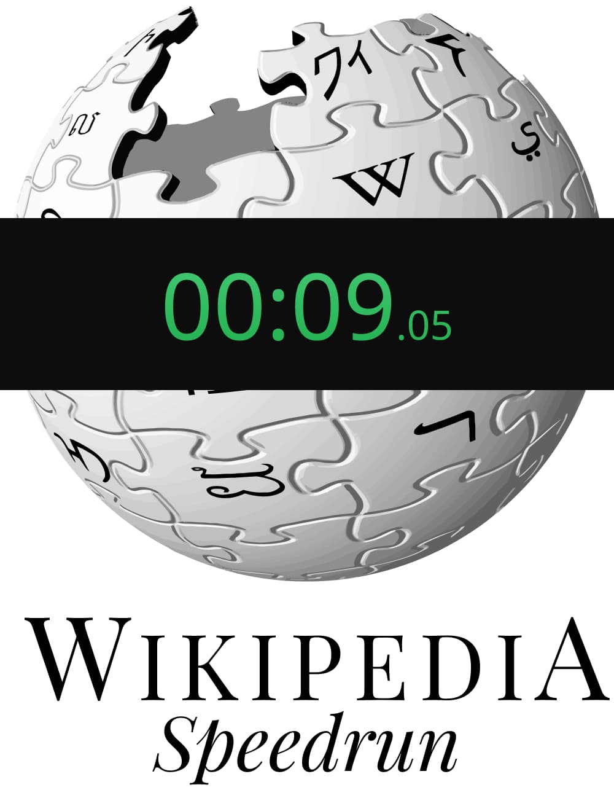

<p align="center">
  
</p>

<p align="center">
  <a href="#">
    
  </a>
  &nbsp
  <a href="#">
    
  </a>
  &nbsp
  <a href="https://twitter.com/unbound_dev" target="_blank">
    
  </a>
</p>

# 🏁 Wikipedia Speedrun Game

The goal of the game is to navigate from starting wikipedia article to some other one, in the least amount of clicks and time.

[Start playing now!](https://wikispeedrun.org/)

## Features

- ▶ No registration required

- 🧭 Choose your own prompts

- ⏱ High precision fair™ timer

  - actually **stops** while you are loading the next article

- 💣 Optional Time Limit

- ✅ Keeps track of your session progress

- 👀 Open source

## Technologies used

- React
- Redux
- React-router
- Create React App
- Emotion
- Reach UI, Mantine

## Build it yourself

This project was created with [Create React App](https://github.com/facebook/create-react-app).

Clone the project:

```
git clone https://github.com/B0und/WikiSpeedrun.git
```

In the project directory you can run `npm i` and then:

### `npm start`

To run the app in the development mode.

### `npm run build`

To build the app for production to the `build` folder.

## License

MIT
